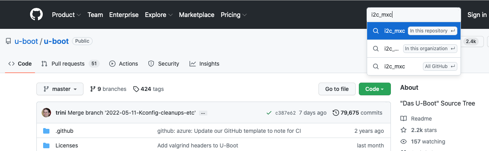
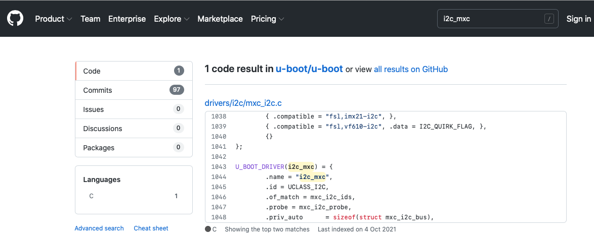

# Library Extension - New Driver Worked Example

A helpful way to show the process of adding a driver is to work through an example step-by-step. The I<sup>2</sup>C driver is relatively straightforward and can be readily tested on the MaaXBoard as there is a power management IC (BD71837MWV) already installed on the board's I<sup>2</sup>C bus. In this worked example, we shall not go as far as installing a driver for the BD71837MWV device itself, but we can probe the I<sup>2</sup>C bus, identify the address of the BD71837MWV device, and perform a sample memory read.

## Establishing the driver

The first place to look is the relevant source code for the driver in U-Boot. This file may be identified as follows.

A `dm tree` command from the U-Boot prompt[^2] should reveal an `i2c` entry, which uses driver `i2c_mxc`.

```text
 Class     Index  Probed  Driver                Name
-----------------------------------------------------------
       ...
 i2c           0  [   ]   i2c_mxc                   |   |-- i2c@30a20000
 i2c           1  [   ]   i2c_mxc                   |   |-- i2c@30a30000
```

[^2]: If the MaaXBoard is powered on and autoboot is interrupted (e.g. press the `Enter` key during the countdown shown in line 37 of the output in the [First Boot](../first_boot.md#boot-to-u-boot-prompt) section), then the `dm tree` command may be entered at the U-Boot prompt.

A search for `i2c_mxc` within U-Boot's github repository [https://github.com/u-boot/u-boot](https://github.com/u-boot/u-boot) reveals the relevant file to be `uboot/drivers/i2c/mxc_i2c.c`:





This file is in the equivalent location within our `libubootdrivers` library, at `projects_libs/libubootdrivers/uboot/drivers/i2c/mxc_i2c.c`.

In the code snippet from the screenshot above, we can see that the driver relies on the `UCLASS_I2C` uclass. This is provided by the file `i2c-uclass.c` in the same directory. At the end of `i2c-uclass.c`, we can see that driver and the other relevant drivers:

```c
UCLASS_DRIVER(i2c) = {
    .id = UCLASS_I2C,
    .name = "i2c",
    ...

UCLASS_DRIVER(i2c_generic) = {
    .id = UCLASS_I2C_GENERIC,
    .name = "i2c_generic",
    ...

U_BOOT_DRIVER(i2c_generic_chip_drv) = {
    .name = "i2c_generic_chip_drv",
    .id = UCLASS_I2C_GENERIC,
    ...
```

This provides the driver references that we need to add to `libubootdrivers` via `projects_libs/libubootdrivers/include/plat/maaxboard/plat_driver_data.h`:

```c
/* Define the uclass drivers to be used on this platform */
...
extern struct uclass_driver _u_boot_uclass_driver__i2c;
extern struct uclass_driver _u_boot_uclass_driver__i2c_generic;

/* Define the drivers to be used on this platform */
...
extern struct driver _u_boot_driver__i2c_mxc;
extern struct driver _u_boot_driver__i2c_generic_chip_drv;
...
```

and `projects_libs/libubootdrivers/src/plat/maaxboard/plat_driver_data.c`:

```c
void initialise_driver_data(void) {
    ...
    driver_data.uclass_driver_array[17] = _u_boot_uclass_driver__i2c;
    driver_data.uclass_driver_array[18] = _u_boot_uclass_driver__i2c_generic;
    ...
    driver_data.driver_array[19] = _u_boot_driver__i2c_mxc;
    driver_data.driver_array[20] = _u_boot_driver__i2c_generic_chip_drv;
    ...
```

We can see that the latter change has added to the arrays. In this example, the two arrays had previously extended to elements [16] and [18] respectively. The increased sizes need to be reflected back in `libubootdrivers/include/plat/maaxboard/plat_driver_data.h` by increasing the size counts:

```c
/* Define the number of different driver elements to be used on this platform */
#define _u_boot_uclass_driver_count  19  // In this example previous count was 17, so +2
#define _u_boot_driver_count         21  // In this example previous count was 19, so +2
...
```

In order to build the new driver files, we need to add them to the `libubootdrivers/CMakeLists.txt` makefile.

There are also some U-Boot configuration macros relevant to I<sup>2</sup>C that are needed, which are also set within the makefile. In this example, we can use the guidance in the [Library Extension - New Driver](uboot_library_add_driver.md#updating-cmakeliststxt) section, and refer to the `.config` file created during the [Building U-Boot for the MaaXBoard](appendices/building_uboot.md) appendix. Using the suggested directory name from that appendix, the filepath would be: `maaxboard_dockerimage/maaxboard-uboot-build/maaxboard-uboot/uboot-imx/.config`.

Extracting I2C-related items (e.g. using `grep -i I2C .config`), we would see:

```text
CONFIG_SYS_I2C_MXC_I2C1=y
CONFIG_SYS_I2C_MXC_I2C2=y
CONFIG_SYS_I2C_MXC_I2C3=y
# CONFIG_SYS_I2C_MXC_I2C4 is not set
CONFIG_SPL_I2C_SUPPORT=y
CONFIG_CMD_I2C=y
# I2C support
CONFIG_DM_I2C=y
# CONFIG_I2C_SET_DEFAULT_BUS_NUM is not set
# CONFIG_DM_I2C_GPIO is not set
# CONFIG_SYS_I2C_IPROC is not set
# CONFIG_SYS_I2C_FSL is not set
# CONFIG_SYS_I2C_CADENCE is not set
# CONFIG_SYS_I2C_DW is not set
# CONFIG_SYS_I2C_INTEL is not set
# CONFIG_SYS_I2C_IMX_LPI2C is not set
# CONFIG_SYS_I2C_IMX_VIRT_I2C is not set
CONFIG_SYS_I2C_MXC=y
# CONFIG_SYS_I2C_MXC_I2C5 is not set
# CONFIG_SYS_I2C_MXC_I2C6 is not set
# CONFIG_SYS_I2C_MXC_I2C7 is not set
# CONFIG_SYS_I2C_MXC_I2C8 is not set
CONFIG_SYS_MXC_I2C1_SPEED=100000
CONFIG_SYS_MXC_I2C1_SLAVE=0
CONFIG_SYS_MXC_I2C2_SPEED=100000
CONFIG_SYS_MXC_I2C2_SLAVE=0
CONFIG_SYS_MXC_I2C3_SPEED=100000
CONFIG_SYS_MXC_I2C3_SLAVE=0
# CONFIG_SYS_I2C_NEXELL is not set
# CONFIG_SYS_I2C_OCORES is not set
# CONFIG_SYS_I2C_ROCKCHIP is not set
# CONFIG_SYS_I2C_MVTWSI is not set
# CONFIG_SYS_I2C_XILINX_XIIC is not set
# CONFIG_SYS_I2C_IHS is not set
# CONFIG_I2C_MUX is not set
# CONFIG_I2C_EDID is not set
```

Removing (most of) the commented items and reordering slightly leaves:

```text
CONFIG_CMD_I2C=y
CONFIG_DM_I2C=y
CONFIG_SYS_I2C_MXC=y
CONFIG_SYS_I2C_MXC_I2C1=y
CONFIG_SYS_I2C_MXC_I2C2=y
CONFIG_SYS_I2C_MXC_I2C3=y
CONFIG_SYS_MXC_I2C1_SPEED=100000
CONFIG_SYS_MXC_I2C1_SLAVE=0
CONFIG_SYS_MXC_I2C2_SPEED=100000
CONFIG_SYS_MXC_I2C2_SLAVE=0
CONFIG_SYS_MXC_I2C3_SPEED=100000
CONFIG_SYS_MXC_I2C3_SLAVE=0
# CONFIG_SYS_I2C_MXC_I2C4 is not set
CONFIG_SPL_I2C_SUPPORT=y
```

This is an excellent starting point and may well be complete; however, we may still need to apply some reasoning. For example, we do not need the final item (although it would do no harm), as SPL is only used when compiling the secondary bootloader and `CONFIG_SPL_I2C_SUPPORT` does not appear in our U-Boot code. The penultimate item concerning I2C4 (currently commented) is inaccurate and is an omission from this `maaxboard-uboot/uboot-imx` build. Examining the DTS file `maaxboard.dts` confirms that there are four I<sup>2</sup>C buses, so we will include a set of I2C4 macros. Note that, although inconsistent, it is not an issue that these macros use I2C1-I2C4 labels, whereas the DTS labels them 0-3. Our convention, such as in the following [CAmkES](#integrating-the-driver-with-camkes) section, will be to use 0-3 labels.

Combining the previous paragraphs, we update the `libubootdrivers/CMakeLists.txt` makefile as follows (showing only extracts relevant to I<sup>2</sup>C).

The `i2c_driver` variable, which by default is `"none"`, is set to `"i2c_mxc"`:

```makefile
# Set up the applicable drivers and platform dependent configuration.
if(KernelPlatImx8mq)
...
    # Define the drivers used for this platform
    ...
    set(i2c_driver "i2c_mxc")
    ...
```

Then a new section is added to handle this:

```makefile
...
############################
# Settings for I2C drivers #
############################

if(i2c_driver MATCHES "none")
    # Nothing to do
else()
    # Enable I2C support
    add_definitions("-DCONFIG_DM_I2C=1")
    # Generic I2C source files
    list(APPEND uboot_deps uboot/drivers/i2c/i2c-uclass.c)

    # Driver specific settings / files
    if(i2c_driver MATCHES "i2c_mxc")
        add_definitions("-DCONFIG_SYS_I2C_MXC=1")
        add_definitions("-DCONFIG_SYS_I2C_MXC_I2C1=1")
        add_definitions("-DCONFIG_SYS_I2C_MXC_I2C2=1")
        add_definitions("-DCONFIG_SYS_I2C_MXC_I2C3=1")
        add_definitions("-DCONFIG_SYS_I2C_MXC_I2C4=1")
        add_definitions("-DCONFIG_SYS_MXC_I2C1_SPEED=100000")
        add_definitions("-DCONFIG_SYS_MXC_I2C1_SLAVE=0")
        add_definitions("-DCONFIG_SYS_MXC_I2C2_SPEED=100000")
        add_definitions("-DCONFIG_SYS_MXC_I2C2_SLAVE=0")
        add_definitions("-DCONFIG_SYS_MXC_I2C3_SPEED=100000")
        add_definitions("-DCONFIG_SYS_MXC_I2C3_SLAVE=0")
        add_definitions("-DCONFIG_SYS_MXC_I2C4_SPEED=100000")
        add_definitions("-DCONFIG_SYS_MXC_I2C4_SLAVE=0")

        list(APPEND uboot_deps uboot/drivers/i2c/mxc_i2c.c)
    else()
        message(FATAL_ERROR "Unrecognised I2C driver. Aborting.")
    endif()
endif()
```

The `list(APPEND uboot_deps ...)` lines add the driver files that were identified earlier, ensuring that they are picked out from the rest of the files held in the `libubootdrivers/uboot` directory and compiled. When they are compiled, they will require extra header files, but those will be picked up automatically from the `uboot` directory.

The `add_definitions` lines establish the configuration macros. Note that `CONFIG_CMD_I2C`, which was in our previous list of candidates, has been excluded, but only until we discuss it further in the forthcoming [API](#establishing-the-driver-api) section.

After these changes, within our `build` directory, `init_build` followed by `ninja` should result in a clean build.

## Integrating the driver with CAmkES

We have established the underlying driver code, but it is not yet integrated within the CAmkES component that we shall be using. Assuming that we use the `uboot-driver-example` test application introduced earlier – see [Using the U-Boot Driver Library](uboot_driver_usage.md#instructions-for-running-the-uboot-driver-example-test) – we need to modify the file `camkes/apps/uboot-driver-example/include/plat/maaxboard/platform_devices.h` as follows.

Firstly, we need to add path definitions so that the devices can be located in the device tree:

```c
#define REG_I2C_0_PATH      "/soc@0/bus@30800000/i2c@30a20000"
#define REG_I2C_1_PATH      "/soc@0/bus@30800000/i2c@30a30000"
#define REG_I2C_2_PATH      "/soc@0/bus@30800000/i2c@30a40000"
#define REG_I2C_3_PATH      "/soc@0/bus@30800000/i2c@30a50000"
...
#define DEV_I2C_0_PATH      REG_I2C_0_PATH
#define DEV_I2C_1_PATH      REG_I2C_1_PATH
#define DEV_I2C_2_PATH      REG_I2C_2_PATH
#define DEV_I2C_3_PATH      REG_I2C_3_PATH
```

These need to be added to `DEV_PATHS` and `DEV_PATH_COUNT` should be modified accordingly:

```c
#define DEV_PATH_COUNT 19 // In this example previous size was 15 so +4

#define DEV_PATHS {   \
    ...               \
    DEV_I2C_0_PATH,   \
    DEV_I2C_1_PATH,   \
    DEV_I2C_2_PATH,   \
    DEV_I2C_3_PATH,   \
    ...
    };
```

Entries for the devices need to be added to `HARDWARE_INTERFACES`:

```c
#define HARDWARE_INTERFACES  \
    ...                      \
    consumes Dummy i2c_0;    \
    consumes Dummy i2c_1;    \
    consumes Dummy i2c_2;    \
    consumes Dummy i2c_3;    \
    ...                      \
    emits Dummy dummy_source;
```

And also added to `HARDWARE_COMPOSITION`:

```c
#define HARDWARE_COMPOSITION                                             \
    ...                                                                  \
    connection seL4DTBHardware i2c_0_conn(from dummy_source, to i2c_0);  \
    connection seL4DTBHardware i2c_1_conn(from dummy_source, to i2c_1);  \
    connection seL4DTBHardware i2c_2_conn(from dummy_source, to i2c_2);  \
    connection seL4DTBHardware i2c_3_conn(from dummy_source, to i2c_3);  \
    ...
```

And also added to `HARDWARE_CONFIGURATION`:

```c
#define HARDWARE_CONFIGURATION                         \
    ...                                                \
    i2c_0.dtb     = dtb({ "path" : REG_I2C_0_PATH });  \
    i2c_1.dtb     = dtb({ "path" : REG_I2C_1_PATH });  \
    i2c_2.dtb     = dtb({ "path" : REG_I2C_2_PATH });  \
    i2c_3.dtb     = dtb({ "path" : REG_I2C_3_PATH });  \
    ...
```

## Establishing the driver API

We now need to work on the driver's API. We are going to access the driver via the U-Boot `i2c` command, such as is available at the U-Boot command line:

```text
u-boot=> i2c
i2c - I2C sub-system

Usage:
i2c bus [muxtype:muxaddr:muxchannel] - show I2C bus info
i2c crc32 chip address[.0, .1, .2] count - compute CRC32 checksum
i2c dev [dev] - show or set current I2C bus
i2c loop chip address[.0, .1, .2] [# of objects] - looping read of device
i2c md chip address[.0, .1, .2] [# of objects] - read from I2C device
i2c mm chip address[.0, .1, .2] - write to I2C device (auto-incrementing)
i2c mw chip address[.0, .1, .2] value [count] - write to I2C device (fill)
i2c nm chip address[.0, .1, .2] - write to I2C device (constant address)
i2c probe [address] - test for and show device(s) on the I2C bus
i2c read chip address[.0, .1, .2] length memaddress - read to memory
i2c write memaddress chip address[.0, .1, .2] length [-s] - write memory
          to I2C; the -s option selects bulk write in a single transaction
i2c flags chip [flags] - set or get chip flags
i2c olen chip [offset_length] - set or get chip offset length
i2c reset - re-init the I2C Controller
i2c speed [speed] - show or set I2C bus speed
u-boot=>
```

We return to `libubootdrivers/src/plat/maaxboard/plat_driver_data.c` to add a new entry to the `cmd_array`:

```c
void initialise_driver_data(void) {
    ...
    driver_data.cmd_array[16] = _u_boot_cmd__i2c;
    ...
```

Corresponding changes are made in `libubootdrivers/include/plat/maaxboard/plat_driver_data.h`:

```c
/* Define the number of different driver elements to be used on this platform */
...
#define _u_boot_cmd_count  17  // In this example previous count was 16, so +1
...

/* Define the u-boot commands to be used on this platform */
...
extern struct cmd_tbl _u_boot_cmd__i2c;
...
```

We need to pull in the U-Boot source code for the `i2c` command from the file `i2c.c` (`projects_libs/libubootdrivers/uboot/cmd/i2c.c`).

As with the previous addition of `.c` files, this needs to be added to the `libubootdrivers/CMakeLists.txt` makefile, along with the CMD configuration macro that we identified earlier. The previous extract from the makefile is repeated below, with two additional lines marked.

```makefile
    ############################
    # Settings for I2C drivers #
    ############################

    if(i2c_driver MATCHES "none")
        # Nothing to do
    else()
        # Enable I2C support
+       add_definitions("-DCONFIG_CMD_I2C=1")
        add_definitions("-DCONFIG_DM_I2C=1")
        # Generic I2C source files
+       list(APPEND uboot_deps uboot/cmd/i2c.c)
        list(APPEND uboot_deps uboot/drivers/i2c/i2c-uclass.c)

        # Driver specific settings / files
        if(i2c_driver MATCHES "i2c_mxc")
            add_definitions("-DCONFIG_SYS_I2C_MXC=1")
            add_definitions("-DCONFIG_SYS_I2C_MXC_I2C1=1")
            add_definitions("-DCONFIG_SYS_I2C_MXC_I2C2=1")
            add_definitions("-DCONFIG_SYS_I2C_MXC_I2C3=1")
            add_definitions("-DCONFIG_SYS_I2C_MXC_I2C4=1")
            add_definitions("-DCONFIG_SYS_MXC_I2C1_SPEED=100000")
            add_definitions("-DCONFIG_SYS_MXC_I2C1_SLAVE=0")
            add_definitions("-DCONFIG_SYS_MXC_I2C2_SPEED=100000")
            add_definitions("-DCONFIG_SYS_MXC_I2C2_SLAVE=0")
            add_definitions("-DCONFIG_SYS_MXC_I2C3_SPEED=100000")
            add_definitions("-DCONFIG_SYS_MXC_I2C3_SLAVE=0")
            add_definitions("-DCONFIG_SYS_MXC_I2C4_SPEED=100000")
            add_definitions("-DCONFIG_SYS_MXC_I2C4_SLAVE=0")

            list(APPEND uboot_deps uboot/drivers/i2c/mxc_i2c.c)
        else()
            message(FATAL_ERROR "Unrecognised I2C driver. Aborting.")
        endif()
    endif()
```

Within our `build` directory, after `init_build` and `ninja`, this should build successfully.

## Testing the driver

Now that we have the I<sup>2</sup>C driver and its API, we can call `i2c` commands from our test application. For example, the following lines can be used within a CAmkES component (in our example, these would be added to file `camkes/apps/uboot-driver-example/components/Test/src/test.c`):

```c
    // I2C test
    run_uboot_command("i2c dev 0"); // Set current i2c bus to zero
    run_uboot_command("i2c probe"); // Probe i2c bus 0
```

On the MaaXBoard, the `i2c probe` command returns `Valid chip addresses: 4B`, which is the address of the BD71837MWV power management IC on the bus. Extending the test case as follows:

```c
    // I2C test
    run_uboot_command("i2c dev 0"); // Set current i2c bus to zero
    run_uboot_command("i2c probe"); // Probe i2c bus 0
    run_uboot_command("i2c md 0x4b 0x0.1 0x20"); // Read 32 bytes from device at address 0x4b
    run_uboot_command("dm tree");
```

will read the first 32 bytes from the BD71837MWV, displaying:

```text
0000: a3 04 03 a2 00 40 40 44 44 00 00 00 00 14 14 14    .....@@DD.......
0010: 1e 14 1e 1e 02 03 03 28 03 00 00 00 00 00 0f 48    .......(.......H
```

Before the `i2c probe`, a `dm tree` command would reveal the presence of the `i2c_mxc` driver:

```text
 Class     Index  Probed  Driver                Name
-----------------------------------------------------------
       ...
 i2c           0  [   ]   i2c_mxc               |   |   |-- i2c@30a20000
 i2c           1  [   ]   i2c_mxc               |   |   |-- i2c@30a30000
 i2c           2  [   ]   i2c_mxc               |   |   |-- i2c@30a40000
 i2c           3  [   ]   i2c_mxc               |   |   |-- i2c@30a50000
```

Following the `i2c probe`, the `dm tree` command shows the instantiation of the `i2c_generic_chip_drv` driver that we ported earlier:

```text
 Class     Index  Probed  Driver                Name
-----------------------------------------------------------
       ...
 i2c           0  [ + ]   i2c_mxc               |   |   |-- i2c@30a20000
 i2c_generi    0  [ + ]   i2c_generic_chip_drv  |   |   |   `-- generic_4b
 i2c           1  [   ]   i2c_mxc               |   |   |-- i2c@30a30000
 i2c           2  [   ]   i2c_mxc               |   |   |-- i2c@30a40000
 i2c           3  [   ]   i2c_mxc               |   |   |-- i2c@30a50000
```
