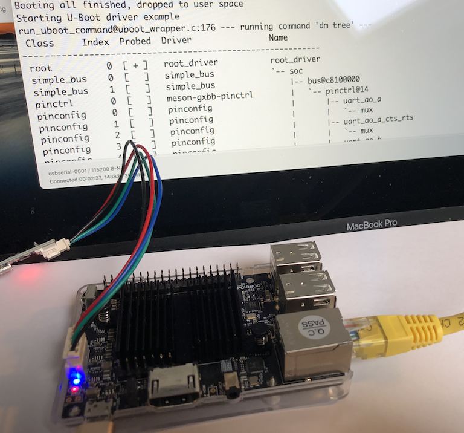

# Odroid-C2 Platform - Worked Example

As part of the review of the [New Platform](uboot_library_add_platform.md)
and [New Driver](uboot_library_add_driver.md) sections of this guide, we ported the
U-Boot Driver Library to build with seL4 on the Odroid-C2 platform.

This appendix gives details of how this was achieved, following the structure
of those earlier sections, but adding details of exact changes to each file.

Our goal is to get the U-Boot [test application](../uboot_driver_usage.md#test-application-uboot-driver-example) running
on the Odroid-C2.

## Repository setup and forks

To work on a new platform build, we need to modify some of the existing repositories.
To do that, we need to "fork" those repositores and do the work in our own local
branches until it's all working. Finally, we would need to open a "Pull Request"
to merge our changes back into the "upstream" repositories.

Additionally, we need to tell the `repo` tool that we want to build from our
own forked repositories (so that the `repo sync` step gets the sources from
our forks, not from the upstream repositories).

You'll need to your own GitHub account to do this. From here on, we'll be using the
GitHub account name `rod-chapman` for our local forks.

1. Using the GitHub web GUI, create your own forks of the `camkes-manifest`, `camkes`,
and `projects_libs` repositories.

2. Clone the `camkes-manifest` fork into your local machine, and create
a new branch called `addc2` to make our changes. In the following commands, remember to change `rod-chapman` to your own GitHub user name:

    ```text
    git clone https://github.com/rod-chapman/camkes-manifest.git
    cd camkes-manifest
    git checkout -b addc2
    git push --set-upstream origin addc2
    cd ..
    ```

3. Similarly, clone the `camkes` and `projects_libs` forks, and add a new branch
to each with the same name.

    ```text
    git clone https://github.com/rod-chapman/camkes.git
    cd camkes
    git checkout -b addc2
    git push --set-upstream origin addc2
    cd ..
    ```

    ```text
    git clone https://github.com/rod-chapman/projects_libs.git
    cd projects_libs
    git checkout -b addc2
    git push --set-upstream origin addc2
    cd ..
    ```

4. Edit the `default.xml` file in the `camkes-manifest` repository to add a new remote (in our
case called `rod`) pointing at our own GitHub account.

    For example, the line to add is

    ```text
    <remote name="rod" fetch="https://github.com/rod-chapman"/>
    ```

5. Similarly, edit the `default.xml` file to specify that the `camkes` and `projects_libs` repositories
should come from the `addc2` branches of our own forked repositories. Find the `project` line for each
repository and modify its entry to specify our own remote (`rod`) and branch (`addc2`).

    For example, the `project` lines for our forks are:

    ```text
    <project name="camkes.git" path="projects/camkes" remote="rod" revision="addc2" upstream="addc2" dest-branch="addc2">
      <linkfile src="easy-settings.cmake" dest="easy-settings.cmake"/>
    </project>
    <project name="projects_libs.git" path="projects/projects_libs" remote="rod" revision="addc2" upstream="addc2" dest-branch="addc2"/>
    ```

6. Commit and push that change:

    ```text
    cd camkes-manifest
    git add default.xml
    git commit -m "Add remote and forked repositories for adding Odroid-C2 platform."
    git push
    cd ..
    ```

## Test Application Build for the MaaxBoard

Having made no other changes at this point, we should be able to build and run
the U-Boot Driver Example program for the MaaxBoard from those newly forked
repositories, just to make sure that creating the forks hasn't broken anything.

The earlier instructions in the [New Platform](../uboot_library_add_platform.md)
section should be followed with one significant change: the first `repo init` command
specifies our fork and branch of the `camkes-manifest` repository.

For example:

```text
repo init -u https://github.com/rod-chapman/camkes-manifest.git -b addc2
```

Assuming that works, then we can start to make modifications to support the Odroid-C2.

## Root Directory, Platform Name, and basic Platform Details

To build the test application, we need to create a new root directory
to hold a `repo` structure and perform the build.

The root directory name is `c2new`. From here on, all directory names given in this section
are relative to that new root directory.

We also know that the Odroid-C2 is already supported by seL4. Its device tree
appears in `kernel/tools/dts/odroidc2.dts`.

The seL4 "platform name" is `odroidc2`.

The system-on-chip device at the heart of the C2 is Amlogic S905, also known as
a "meson" SoC.

We create that root directory, and initialise our build environment. Remember to use the
Docker container from the [build environment setup](../build_environment_setup.md#usage) section
from here on:

```text
# In the docker container with working directory at /host
mkdir c2new
cd c2new
repo init -u https://github.com/rod-chapman/camkes-manifest.git -b addc2
repo sync
```

At this point, we return to the structure of the [New Platform](../uboot_library_add_platform.md)
section.

## Update the library's CMake file to support the platform

We need to update the file `projects/projects_libs/libubootdrivers/CMakeLists.txt` to
include bare-minimum support for our new platform.

From the seL4 documentation we can find that the value of the `${KernelPlatform}`
variable is `odroidc2`. We also need to locate the correct C header files for this
platform and create a sym-link to them, so we add:

```makefile
+ elseif("${KernelPlatform}" STREQUAL "odroidc2")
+     # Define the drivers used for this platform
+     set(arch_source "./arch-meson")
+     set(arch_target "../projects/uboot/arch/arm/include/asm/arch")
+     execute_process(COMMAND ln -fsn ${arch_source} ${arch_target})
```

in the "Platform specific settings" section of the file.

## Adding the GPIO Driver

At this point, we decided to add support for the U-Boot "General Purpose IO" device
driver, also known as "GPIO".

We start by searching the Odroid-C2 device tree file for the string "gpio-controller" in
the file `kernel/tools/dts/odroidc2.dts`.

This appears in two places in the Device Tree, with path-names `/soc/bus@c8100000/pinctrl@14/bank@14`
and `/soc/periphs@c8834000/pinctrl@4b0/bank@4b0`.

From those nodes of the tree we search "up" the tree (towards the "soc" root node) for a
"compatible" string. We find

```text
compatible = "amlogic,meson-gxbb-aobus-pinctrl";
```

for the former entry, and

```text
compatible = "amlogic,meson-gxbb-periphs-pinctrl";
```

for the latter.

## Finding the driver source code

Those "compatible" strings give us the key to finding the correct source file from the U-Boot sources
that we need to support the C2's GPIO device(s).

We can search the sources for all the U-Boot drivers for either of those strings with:

```text
cd projects/uboot/drivers
grep -r "meson-gxbb-.*-pinctrl" .
```

which yields a result:

```text
./pinctrl/meson/pinctrl-meson-gxbb.c:           .compatible = "amlogic,meson-gxbb-periphs-pinctrl",
./pinctrl/meson/pinctrl-meson-gxbb.c:           .compatible = "amlogic,meson-gxbb-aobus-pinctrl",
```

showing us that the single source file `pinctrl-meson-gxbb.c` implements a
driver that is compatible with both of the devices we're interested in.

At the bottom of that source file, we find the declarations:

```c
static const struct udevice_id meson_gxbb_pinctrl_match[] = {
        {
                .compatible = "amlogic,meson-gxbb-periphs-pinctrl",
                .data = (ulong)&meson_gxbb_periphs_pinctrl_data,
        },
        {
                .compatible = "amlogic,meson-gxbb-aobus-pinctrl",
                .data = (ulong)&meson_gxbb_aobus_pinctrl_data,
        },
        { /* sentinel */ }
};

U_BOOT_DRIVER(meson_gxbb_pinctrl) = {
        .name = "meson-gxbb-pinctrl",
        .id = UCLASS_PINCTRL,
        .of_match = of_match_ptr(meson_gxbb_pinctrl_match),
        .probe = meson_pinctrl_probe,
        .priv_auto      = sizeof(struct meson_pinctrl),
        .ops = &meson_gx_pinctrl_ops,
};
```

so we know the driver is called "meson-gxbb-pinctrl" and it is compatible with both
the "aobus" and "periphs" instances of that device on the C2.

## Adding a source dependency for the GPIO driver

Having identified which source file we need to build, we can add it to the CMake file.

Firstly, we set the variable "iomux_driver" to the value we just found - "meson-gxbb-pinctrl" -
by adding

```makefile
     elseif("${KernelPlatform}" STREQUAL "odroidc2")
         # Define the drivers used for this platform
+        set(iomux_driver "meson-gxbb-pinctrl")
         ...
```

in the "Platform Specific Settings" section of the `CMakeLists.txt` file as above.

In the same file, we then go to the "Settings for IOMUX Drivers" section and add
an `elseif` branch to add the required source code dependencies when that driver is selected:

```makefile
    elseif(iomux_driver MATCHES "meson-gxbb-pinctrl")
        list(APPEND uboot_deps uboot/drivers/pinctrl/meson/pinctrl-meson-gxbb.c)
```

## Resolving Compilation Issues

An attempt to compile the U-Boot Driver Test application fails owing to missing sources, where
our new driver code depends on some other code that we have not included yet.

Identification of the missing units (and further searching of the U-Boot driver sources) shows that
we additionally need the `pinctrl-meson.c` and `pinctrl-meson-gx-pmx.c` source files to be included, so
we update `CMakeLists.txt` to include them:

```makefile
    elseif(iomux_driver MATCHES "meson-gxbb-pinctrl")
        list(APPEND uboot_deps uboot/drivers/pinctrl/meson/pinctrl-meson-gxbb.c)
        list(APPEND uboot_deps uboot/drivers/pinctrl/meson/pinctrl-meson.c)
        list(APPEND uboot_deps uboot/drivers/pinctrl/meson/pinctrl-meson-gx-pmx.c)
```

## Platform Specific Linker Lists

Next, we need to add the "Linker Lists" data structures for this platform
and for the set of device drivers that we want to support.

First, we create two new directories in our fork of the projects_libs repository:

```text
projects_libs/libubootdrivers/include/plat/odroidc2
```

and

```text
projects_libs/libubootdrivers/src/plat/odroidc2
```

Following the templates from the [New Platform](uboot_library_add_platform.md) section,
we create `plat_driver_data.h` in the former of those directories.

There are five UClass Drivers that are effectively mandatory (`nop`, `root`, `simple_bus`, `phy` and `blk`),
and we want to add two more (`pinconfig` and `pinctrl`), making a total of 7, so we declare in
`plat_driver_data.h`:

```c
#define _u_boot_uclass_driver_count     7

/* Define the uclass drivers to be used on this platform */
extern struct uclass_driver _u_boot_uclass_driver__nop;
extern struct uclass_driver _u_boot_uclass_driver__root;
extern struct uclass_driver _u_boot_uclass_driver__simple_bus;
extern struct uclass_driver _u_boot_uclass_driver__phy;
extern struct uclass_driver _u_boot_uclass_driver__blk;
extern struct uclass_driver _u_boot_uclass_driver__pinconfig;
extern struct uclass_driver _u_boot_uclass_driver__pinctrl;
```

We require a total of 4 drivers, so:

```c
#define _u_boot_driver_count            4

/* Define the drivers to be used on this platform */
extern struct driver _u_boot_driver__root_driver;
extern struct driver _u_boot_driver__simple_bus;
extern struct driver _u_boot_driver__pinconfig_generic;
extern struct driver _u_boot_driver__meson_gxbb_pinctrl;
```

and 4 commands:

```c
#define _u_boot_cmd_count               4

/* Define the u-boot commands to be used on this platform */
extern struct cmd_tbl _u_boot_cmd__dm;
extern struct cmd_tbl _u_boot_cmd__env;
extern struct cmd_tbl _u_boot_cmd__setenv;
extern struct cmd_tbl _u_boot_cmd__pinmux;
```

We can now create `plat_driver_data.c` in the `src/plat/odroidc2` directory to initialise
the actual data structures thus:

```c
void initialise_driver_data(void) {
    driver_data.uclass_driver_array[0]  = _u_boot_uclass_driver__nop;
    driver_data.uclass_driver_array[1]  = _u_boot_uclass_driver__root;
    driver_data.uclass_driver_array[2]  = _u_boot_uclass_driver__simple_bus;
    driver_data.uclass_driver_array[3]  = _u_boot_uclass_driver__phy;
    driver_data.uclass_driver_array[4]  = _u_boot_uclass_driver__blk;
    driver_data.uclass_driver_array[5]  = _u_boot_uclass_driver__pinconfig;
    driver_data.uclass_driver_array[6]  = _u_boot_uclass_driver__pinctrl;

    driver_data.driver_array[0]  = _u_boot_driver__root_driver;
    driver_data.driver_array[1]  = _u_boot_driver__simple_bus;
    driver_data.driver_array[2]  = _u_boot_driver__pinconfig_generic;
    driver_data.driver_array[3]  = _u_boot_driver__meson_gxbb_pinctrl;

    driver_data.cmd_array[0]  = _u_boot_cmd__dm;
    driver_data.cmd_array[1]  = _u_boot_cmd__env;
    driver_data.cmd_array[2]  = _u_boot_cmd__setenv;
    driver_data.cmd_array[3]  = _u_boot_cmd__pinmux;
}
```

Note how the number of assignments and array elements initialised must exactly match
the values of the constants defined in the `plat_driver_data.h` file.

## Add Odroid-C2 support in the U-Boot Driver Example test program

We now need to modify the CAmkES configuration of our test program to tell CAmkES that our program is
configured for this platform and our code can have capabilities allocation to access certain devices.

This is done by creating a specific `platform_devices.h` file for the Odroid-C2 in the example application.

We create `camkes/apps/uboot-driver-example/include/plat/odroidc2/platform_devices.h` with the following
content:

```c
#pragma once

/* List the set of device tree paths that include the 'reg' entries
 * for memory regions that will need to be mapped */
#define BUS_PATH     "/soc/bus@c8100000"
#define PERIPHS_PATH "/soc/periphs@c8834000"
#define REG_PATHS { BUS_PATH, PERIPHS_PATH };
#define REG_PATH_COUNT 2

/* List the set of device tree paths for the devices we wish to access.
 * Note these need to be the root nodes of each device to be accessed */
#define PINCTRL1_PATH "/soc/bus@c8100000/pinctrl@14"
#define PINCTRL2_PATH "/soc/periphs@c8834000/pinctrl@4b0"
#define DEV_PATHS { PINCTRL1_PATH, PINCTRL2_PATH };
#define DEV_PATH_COUNT 2

/* Provide the hardware settings for CAmkES. Note that we only need to inform
 * CAmkES of the devices with memory mapped regions, i.e. the REG_xxx
 * devices. See https://docs.sel4.systems/projects/camkes for syntax */

#define HARDWARE_INTERFACES                                                   \
    consumes Dummy bus;                                                       \
    consumes Dummy periphs;                                                   \
    emits Dummy dummy_source;

#define HARDWARE_COMPOSITION                                                \
    connection seL4DTBHardware bus_conn(from dummy_source, to bus);         \
    connection seL4DTBHardware periphs_conn(from dummy_source, to periphs);

#define HARDWARE_CONFIGURATION                                              \
    bus.dtb     = dtb({ "path" : BUS_PATH });                               \
    periphs.dtb = dtb({ "path" : PERIPHS_PATH });                           \
```

Refer to the [CAmkES tutorial](https://docs.sel4.systems/Tutorials/hello-camkes-0.html)
and [documentation](https://docs.sel4.systems/projects/camkes/) for the exact syntax
and semantics of these declarations.

We also need to update the main test program to enable the specific tests that we want to run
on the Odroid-C2. The source file is in `projects/camkes/apps/uboot-driver-example/components/Test/src/test.c`.

Each specific test for device `XXX` is only run if a C preprocessor symbol `TEST_XXX` is defined. A set of these are defined by testing each appropriate `CONFIG_PLAT_YYY` symbol that might be defined by CMake. `test.c` already defines a set of tests are are appropriate for the MaaxBoard, so we need to add a set for the Odroid-C2. At this point, only the `pinmux` command is implemented, so we add:

```text
  /* Determine which functionality to test based upon the platform */
  #if defined(CONFIG_PLAT_MAAXBOARD)
      ...
+ #elif defined(CONFIG_PLAT_ODROIDC2)
+     #define TEST_PINMUX
  #else
      ...
  #endif
```

## Compilation

At this point, the U-Boot Driver Example test program should build for the C2.

Make sure all your changes are committed and pushed to GitHub, then (in the Docker container):

```text
cd /host/c2new
repo sync
mkdir build
cd build
../init-build.sh -DCAMKES_APP=uboot-driver-example -DPLATFORM=odroidc2 -DSIMULATION=FALSE
ninja
```

This should result in a binary image in the `images` subdirectory that can be copied to a
USB memory stick or a TFTP server of your choice. As before, we assume that the image is renamed
to `sel4_image` if that is the default set up in your U-Boot configuration.

## Running the test application

In our case, we download using TFTP, so we start the TFTP Server Application as before, start CoolTerm,
reboot the Odroid-C2, and hit `Return` immediately to interrupt whatever default boot
sequence is installed.  Then we set the `ipaddr` and `serverip` environment variables in
U-Boot, and use the `tftpboot sel4_image` command to download the image.

On our system, our ethernet subnet is `192.168.2.x` and the image is built to
run with a start address of `0x20000000`, so the entire
sequence of commands to setup, download and start the test program is:

```text
odroidc2# setenv ipaddr 192.168.2.2
odroidc2# setenv serverip 192.168.2.1
odroidc2# tftpboot sel4_image
odroidc2# go 0x20000000
```

## Test results

Most of the commands that are expected to work on the MaaxBoard
will fail on the Odroid-C2 owing to missing drivers, but the `dm tree` command
should work and show the `pinctrl` devices that we have added. The output that we see,
truncated to only show the first 4 levels of the device tree, is as follows:

```text
Starting U-Boot driver example
run_uboot_command@uboot_wrapper.c:176 --- running command 'dm tree' ---
 Class     Index  Probed  Driver                Name
-----------------------------------------------------------
 root          0  [ + ]   root_driver           root_driver
 simple_bus    0  [   ]   simple_bus            `-- soc
 simple_bus    1  [   ]   simple_bus                |-- bus@c8100000
 pinctrl       0  [   ]   meson-gxbb-pinctrl        |   `-- pinctrl@14
 pinconfig     0  [   ]   pinconfig                 |       |-- uart_ao_a
 pinconfig     1  [   ]   pinconfig                 |       |   `-- mux
 pinconfig     2  [   ]   pinconfig                 |       |-- # and many more - truncated here
 pinconfig     3  [   ]   pinconfig                 |       |   `-- mux
 simple_bus    2  [   ]   simple_bus                `-- periphs@c8834000
 pinctrl       1  [   ]   meson-gxbb-pinctrl            `-- pinctrl@4b0
 pinconfig    40  [   ]   pinconfig                         |-- emmc
 pinconfig    41  [   ]   pinconfig                         |   `-- mux
 pinconfig    42  [   ]   pinconfig                         |-- # and many more - truncated here
 pinconfig    43  [   ]   pinconfig                         |   `-- mux
run_uboot_command@uboot_wrapper.c:181 --- command 'dm tree' completed with return code 0 ---
Completed U-Boot driver example
```

## Adding support for the LED and GPIO commands

At this point, we can go further and add support for the U-Boot `led` and `gpio` commands.

The LEDs are driven by the lower-level GPIO `pinctrl` and `pinmux` subsystems, so we look in the Odroid-C2's device tree for the tell-tale "compatible" string for the appropriate driver. We find:

```text
leds {
    compatible = "gpio-leds";
    blue {
        label = "c2:blue:alive";
        gpios = < 0x2e 0x0d 0x01 >;
        linux,default-trigger = "heartbeat";
        default-state = "off";
    };
};
```

This tells is to look for the declaration of a `gpio-leds` driver in the U-Boot sources. Indeed, in `uboot/drivers/led/led_gpio.c`, we find:

```c
U_BOOT_DRIVER(led_gpio) = {
        .name   = "gpio_led",
        .id     = UCLASS_LED,
        .ops    = &gpio_led_ops,
        .priv_auto      = sizeof(struct led_gpio_priv),
        .probe  = led_gpio_probe,
        .remove = led_gpio_remove,
};

static const struct udevice_id led_gpio_ids[] = {
        { .compatible = "gpio-leds" },
        { }
};

U_BOOT_DRIVER(led_gpio_wrap) = {
        .name   = "gpio_led_wrap",
        .id     = UCLASS_NOP,
        .of_match = led_gpio_ids,
        .bind   = led_gpio_bind,
};
```

showing that we need to add the `led_gpio` and `led_gpio_wrap` drivers to our build.

In addition, we need to add the general GPIO driver which, for this platform, is called `meson_gx_gpio_driver`.

In summary, we need to:

- add 2 more UClass Drivers, 3 more Drivers, and 2 more U-Boot commands to the library configuration in `plat_driver_data.h`:

```text
#define _u_boot_uclass_driver_count     9 // was 7 previously
#define _u_boot_driver_count            7 // was 4 previously
#define _u_boot_cmd_count               6 // was 4 previously

  extern struct uclass_driver _u_boot_uclass_driver__pinconfig;
  extern struct uclass_driver _u_boot_uclass_driver__pinctrl;
+ extern struct uclass_driver _u_boot_uclass_driver__gpio;
+ extern struct uclass_driver _u_boot_uclass_driver__led;

  extern struct driver _u_boot_driver__pinconfig_generic;
  extern struct driver _u_boot_driver__meson_gxbb_pinctrl;
+ extern struct driver _u_boot_driver__meson_gx_gpio_driver;
+ extern struct driver _u_boot_driver__led_gpio_wrap;
+ extern struct driver _u_boot_driver__led_gpio;

  extern struct cmd_tbl _u_boot_cmd__pinmux;
+ extern struct cmd_tbl _u_boot_cmd__gpio;
+ extern struct cmd_tbl _u_boot_cmd__led;
```

- initialise these structures properly in `plat_driver_data.c`, adding:

```text
  driver_data.uclass_driver_array[5]  = _u_boot_uclass_driver__pinconfig;
  driver_data.uclass_driver_array[6]  = _u_boot_uclass_driver__pinctrl;
+ driver_data.uclass_driver_array[7]  = _u_boot_uclass_driver__gpio;
+ driver_data.uclass_driver_array[8]  = _u_boot_uclass_driver__led;

  driver_data.driver_array[2]  = _u_boot_driver__pinconfig_generic;
  driver_data.driver_array[3]  = _u_boot_driver__meson_gxbb_pinctrl;
+ driver_data.driver_array[4]  = _u_boot_driver__meson_gx_gpio_driver;
+ driver_data.driver_array[5]  = _u_boot_driver__led_gpio_wrap;
+ driver_data.driver_array[6]  = _u_boot_driver__led_gpio;

  driver_data.cmd_array[3]  = _u_boot_cmd__pinmux;
+ driver_data.cmd_array[4]  = _u_boot_cmd__gpio;
+ driver_data.cmd_array[5]  = _u_boot_cmd__led;
```

- modify `CMakeLists.txt` to enable those drivers and sources in the CMake build process:

```makefile
     elseif("${KernelPlatform}" STREQUAL "odroidc2")
         # Define the drivers used for this platform
         set(iomux_driver "meson-gxbb-pinctrl")
+        set(gpio_driver "meson_gx_gpio_driver")
+        set(led_driver "gpio_led")
         ...
```

Next, we declare the `/leds` device tree path in the configuration of the U-Boot Driver Example program in `camkes/apps/uboot-driver-example/include/plat/odroidc2/platform_devices.h` and add that to the list of `DEV_PATHS` that are required by our test application:

```text
#define LEDS_PATH "/leds"
#define DEV_PATHS { PINCTRL1_PATH, PINCTRL2_PATH, LEDS_PATH };
#define DEV_PATH_COUNT 3
```

Finally, the main test program `test.c` is modified to run tests for the `gpio` and `led` commands

```text
  #elif defined(CONFIG_PLAT_ODROIDC2)
      #define TEST_PINMUX
+     #define TEST_GPIO
+     #define TEST_LED
+     #define TEST_LED_NAME_1 "c2:blue:alive"
+     #define TEST_LED_NAME_2 "c2:blue:alive"
```

If we run the test program, we first notice the tail of the output of the `dm tree` command now includes:

```text
 gpio          1  [ + ]   meson-gx-gpio         |           `-- meson-gpio
 nop           0  [ + ]   gpio_led_wrap         `-- leds
 led           0  [ + ]   gpio_led                  `-- blue
```

Secondly the `led list` command produces:

```text
c2:blue:alive   off
```

The `pinmux status -a` command also works, and lists the current assignment of the general GPIO pins to their current specific function.

## Wrapping up

This section has given a detailed walkthrough of how the U-Boot driver framework and test application
have been built and run under seL4 on the Odroid-C2. We've also shown how the basic GPIO "pinctrl"
driver from U-Boot can be added to our configuration for that platform and how the
U-Boot `dm tree` command works and shows the presence of that device. We then went on to add support for the `pinmux` and `led` commands and demonstrated their use in a simple test application.


