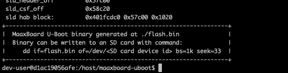

# Building U-Boot

In order to build U-Boot, the seL4devkit Docker build environment is required, please see [Build Environment Setup](../build_environment_setup.md) to setup this up if you haven't already done so.

1. In a suitable location on your host machine, create a new directory with a relevant name, e.g. `maaxboard-uboot-build`

2. Using a terminal, run the following command to start the seL4devkit Docker environment, changing `/your/working/folder/path/here` to the absolute path of the folder you just created:

    - `docker run -it --rm -v /your/working/folder/path/here:/host:z ghcr.io/sel4devkit/maaxboard:latest`

    - For more information on starting the seL4devkit build environment, refer to the [usage section of 'Build Environment Setup'](../build_environment_setup.md#usage).

3. Once the bash shell in your build environment has loaded, you can now clone the [maaxboard-uboot](https://github.com/sel4devkit/maaxboard-uboot) repository from `https://github.com/sel4devkit/maaxboard-uboot.git` using git.

4. Once git has successfully cloned the repository, a new folder called `maaxboard-uboot` should be created, containing a README file, some build scripts, and a `firmware` folder.

5. Once you have verified you have the correct files, run the main build script using `./build.sh` (the other build scripts are used if [building offline](./devkit_offline_use.md#building-u-boot-offline)).

6. `build.sh` will clone a number of git repositories and extract necessary files from them, after which you will be presented with a license agreement for the NXP firmware for the i.MX8. You can navigate this agreement with the up and down arrow keys. Assuming you are happy to accept the agreement, type `y` to accept when prompted. *Note: if you decline the EULA, the build process will be terminated, since the firmware is required to build U-Boot.*

7. After the script has completed the build process, if successful you should see the following:

    *Note: During compilation of U-Boot the following spurious warning is generated and can be safely ignored:* `WARNING 'lpddr4_pmu_train_1d_imem.bin' not found, resulting binary is not-functional`.

8. The generated `flash.bin` file is now ready to write to storage media. Please see [Manually writing U-Boot to an SD card](./writing_uboot_to_sd_card.md) for details on how to do this.

## Understanding build.sh

Whilst an understanding of how the build script ([`build.sh`](https://github.com/sel4devkit/maaxboard-uboot/blob/main/build.sh)) functions is not required for most use cases, such information is useful in case the developer has a need to modify the script. For example, it may be necessary to adapt the script for a different board or to update the script to use a different version or fork of U-Boot.

It is worth noting that `build.sh` does not produce a U-Boot image containing HDMI firmware, i.e. it builds an image only suitable for use of the board in 'headless' mode. If display output is required the build script will need to be modified to configure U-Boot with the device tree variant and include firmware for the desired display output (e.g. HDMI or MIPI-DSI)

This section seeks to document the origins of the script and provide guidance on potential modifications.

### Origin and rationale

The steps performed by the build script mirror, and are distilled from, those performed by the much more complex build script [`mk-imx-boot.sh`](https://github.com/Avnet/uboot-imx/blob/maaxboard_v2020.04_5.4.24_2.1.0/mk-imx-boot.sh) provided by the Avnet U-Boot fork.

The `build.sh` build script was produced to:

1. Remove much of the complexity of the `mk-imx-boot.sh` script, cutting it down to the bare minimum required to support the MaaXBoard, thereby making the required build steps clear; and

2. Ensure that the build script only uses resources held within the development kit GitHub account, thereby ensuring that the ability to build a known-working U-Boot cannot be broken by changes to upstream repositories.

## Build steps

To build U-Boot for the MaaXBoard, and indeed any board, the following resources are generally required:

- A version of U-Boot with drivers supporting the board and a configuration file targeting the board. This will typically be either the U-Boot mainline or a fork of U-Boot provided by the board manufacturer.

- Firmware for the board hardware, e.g. to initialise and configure hardware such as the memory. This will typically be supplied by the board or SoC manufacturer.

- Firmware for the processor. In the case of an ARM-based SoC, such as the i.MX8MQ used on the MaaXBoard, this is the ATF (ARM Trusted Firmware).

- A tool to compose all of the required elements (e.g. compiled U-Boot binaries and firmware blobs) into the structure and layout expected by the board at boot. In the case of i.MX-based SoCs this tool is [`imx-mkimage`](https://github.com/sel4devkit/imx-mkimage).

To satisfy the requirements above, the build script performs the following steps[^note]:

1. Clones a copy of the U-Boot sources that support the MaaXBoard.

2. Clones a copy of the ATF (ARM Trusted Firmware).

3. Clones a copy of the source code of the `imx-mkimage` tool.

4. Configures U-Boot build system for the MaaXBoard and then compiles the U-Boot binaries.

5. Decompresses and compiles the DDR PHY and HDMI firmware.

6. Compiles the ATF configured for the i.MX8MQ SoC as used by the MaaXBoard.

7. Copies all of the binaries and firmware elements produced in the earlier steps into the locations expected by `imx-mkimage`.

8. Builds and executes `imx-mkimage` configured for the i.MX8MQ SoC in 'headless' mode.

[^note]: To facilitate [offline use of the developer kit](./devkit_offline_use.md), these steps are factored into the `clone.sh` and `build-offline.sh` scripts called by `build.sh`.

The build steps, if successful, result in a binary named `flash.bin` which is suitable for booting the MaaXBoard if placed in a specific location on an SD card as documented within the section [Manually writing U-Boot to an SD card](./writing_uboot_to_sd_card.md).

## Modifying the build script

Given the detailed explanation of the steps performed by the build script above, it is expected that modifying the script should be relatively straightforward.

Whilst the build steps and their ordering is expected to remain unchanged, the contents of each of those steps can easily be changed, for example:

- The locations of Git repositories and the branch cloned by the script can be modified.

- The version of the [firmware](https://github.com/sel4devkit/maaxboard-uboot/tree/main/firmware) supplied by NXP can be changed.

- The choices of configuration options and firmware to be included can be changed.

It is expected that such changes would be made within a fork of the [`maaxboard-uboot`](https://github.com/sel4devkit/maaxboard-uboot) Git repository that provides the build script and folder structure supporting the build.
