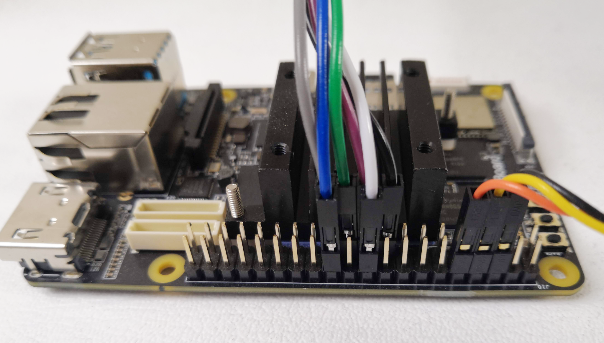
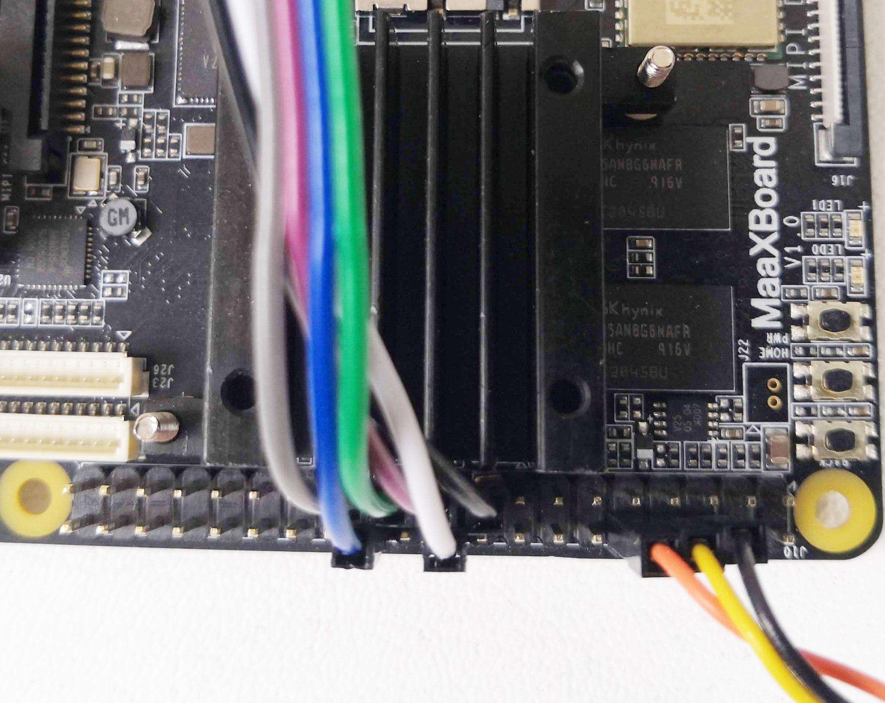
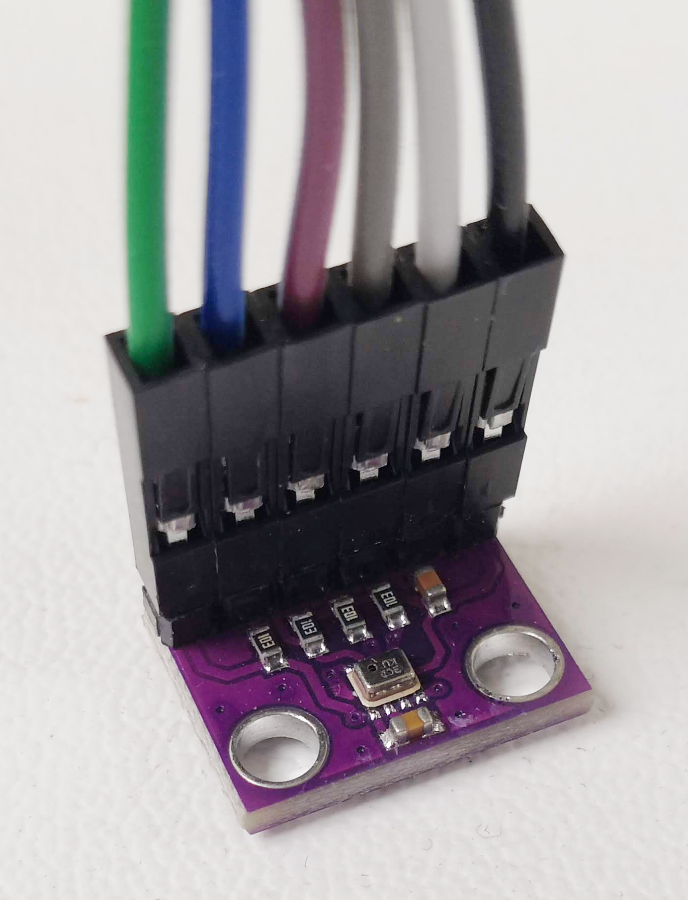
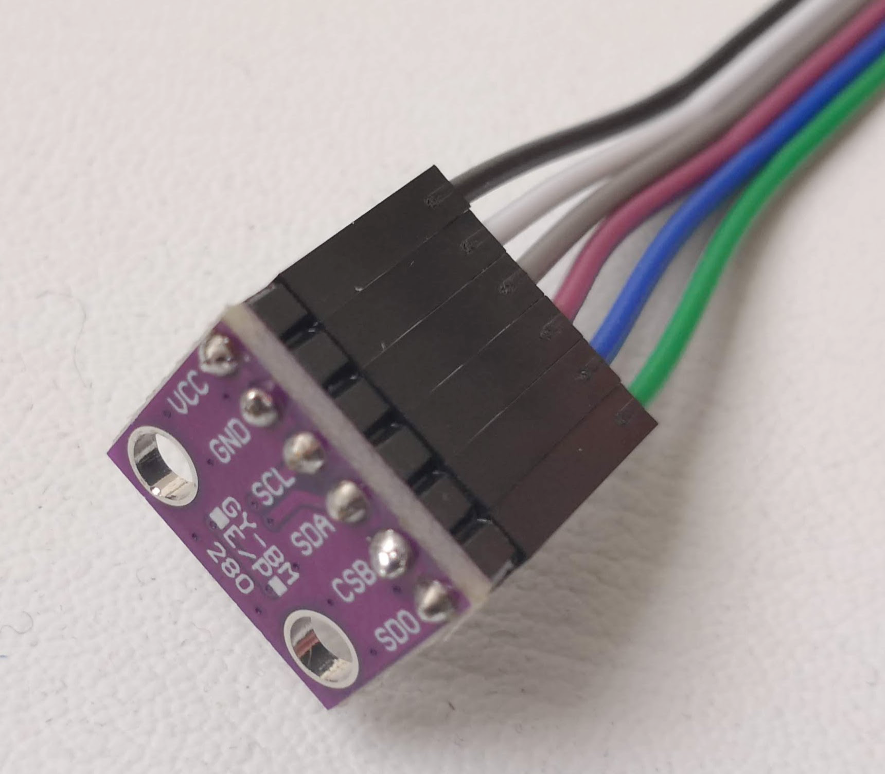

# Optional Extra - SPI Bus Pressure Sensor

Having added a Serial Peripheral Interface (SPI) driver, it was tested with a widely available and inexpensive board module that uses the [Bosch BMP280](https://www.bosch-sensortec.com/products/environmental-sensors/pressure-sensors/bmp280/) barometric pressure / temperature sensor. Here is a link for a typical example: [Amazon link](https://www.amazon.co.uk/AZDelivery-Generic-BMP280-Barometric-Pressure/dp/B07D8TPVVY).

If this sensor is connected, the `uboot-driver-example` test application will use it (see [Using the U-Boot Driver Library](uboot_driver_usage.md#instructions-for-running-the-uboot-driver-example-test)).

The wiring connections using the MaaXBoard's 40-pin GPIO connector are as follows, accompanied by some reference photographs.

| GPIO Pin | Sensor Pin  |
|----------|-------------|
|   17     |  VCC        |
|   19     |  SDA (MOSI) |
|   20     |  GND        |
|   21     |  SDO (MISO) |
|   23     |  SCL        |
|   24     |  CSB (SSO)  |

