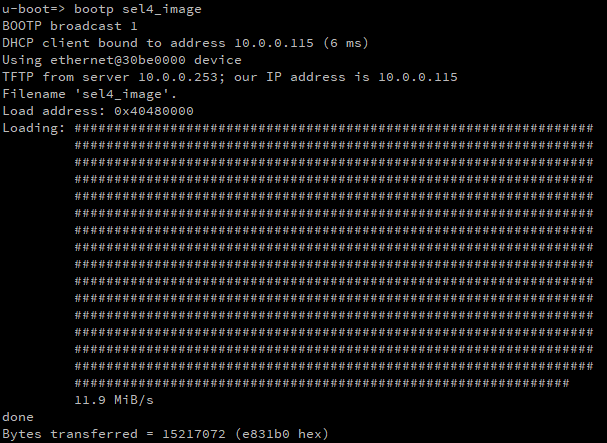

# Setting up a netboot server using TFTP - Instructions for Linux

The most efficient way of booting from an image is to set up a TFTP server from which the board can read from. This removes the need to repeatedly flash an SD card with a new image, and instead the image can just be copied to the appropriate directory where it can be read and booted. The strategy used will depend on the operating system used, but this guide is for Linux.

1. [Dnsmasq](https://thekelleys.org.uk/dnsmasq/doc.html) provides a network infrastructure for small networks and is designed to be lightweight. The program can be installed using apt-get

```
sudo apt-get install dnsmasq
```

2. Create the root folder where the image will be stored. In this example, the path will be `/var/lib/tftpboot`.

2. Identify the ethernet interface you will be connecting the board to using `ip addr` command from the terminal.


From this command, the necessary information is the *mac address* of the interface (01:23:45:67:89:0a in this case), and the *ip address* (10.0.0.253).

3. Edit the file `/etc/dnsmasq.conf` with the following content:

```
interface=eno2
dhcp-range=10.0.0.101,10.0.0.200,12h
dhcp-host=01:23:45:67:89:0a,svr1,infinite
dhcp-boot=sel4_image
enable-tftp
tftp-root=/var/lib/tftpboot
```

where the values are replaced with those corresponding to the output of the `ip addr` command. The `dhcp-range` should act as a net mask to allow ip allocation to the board.

4. With the setup complete for dnsmasq, the service can be started and enabled. To ensure the service has properly started, the `status` command can be used.

```
systemctl start dnsmasq
systemctl enable dnsmasq
systemctl status dnsmasq
```

If, at any point, any of the configuration files need to be changed, the service will need to be restarted with `systemctl restart dnsmasq` to see these changes reflected.

5. If a firewall is enabled, rules will need to be added to allow requests to pass to the dnsmasq server. The following commands will permit requests:

```
iptables -A INPUT -i eno2 --dport 69 -j ACCEPT
iptables -A INPUT -i eno2 -p tcp --dport 67:68 -j accept
```

6. The board is now ready to use the tftp server, and can be powered on with the uboot SD card inserted, where it will try to boot using `sel4_image` stored in `/var/lib/tftpboot`.

7. If an error occurs and uboot drops to a prompt, the image can still be booted using uboot commands. Using `bootp sel4_image` will load the file to a memory address (usually `40480000`), where it can then be booted using `bootelf 40480000`. This method can also be used to boot different images. By using `bootp`, any file contained within `/var/lib/tftpboot` can be loaded and then booted.

