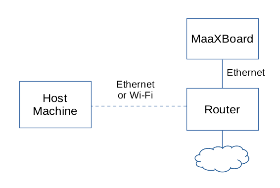

# Bootloader

## Overview

When a computer is turned off, its software remains stored in non-volatile memory. When the computer is powered on, a bootstrap loader is required: a small, low-level program to configure the computer's memory and devices sufficient to then be able to load further software, such as a bare-metal application or operating system, into RAM and then call it.

**Das U-Boot** (known as "the Universal Boot Loader" and often shortened to U-Boot) is an open-source bootloader commonly used in embedded devices. For such low-level operations, it has to be customized for the hardware on which it is running.

As part of this developer kit we have provided both prebuilt U-Boot binaries (see [here](sd_card_preparation.md)) and tooling to build U-Boot binaries (see [here](appendices/building_uboot.md)) suitable for the MaaXBoard.

## Loading the Application

After U-Boot has configured the MaaXBoard's memory and devices, it is able to load an application into RAM and then execute it. It is possible for a user to do this interactively using U-Boot commands via the serial terminal on the host machine. It is also possible and convenient to provide a U-Boot configuration file `uEnv.txt` that runs automatically; both options are documented below.

### Methods of Loading

We cover three primary mechanisms for loading the application into RAM by U-Boot:

- from SD card;
- from USB flash drive;
- via TFTP.

Additional mechanisms are available, such as downloading over the serial cable; however, this would be much slower compared with the options above and is not considered further here. Downloading from on-board flash memory is another possible mechanism, but that is not applicable to the MaaXBoard.

The remainder of this section assumes that you have an application in the form of an executable ELF file called `sel4_image`. We will create this as our test application [later in this documentation](building_applications.md), but this section is concerned with the loading mechanisms rather than the executable itself.

#### Loading from SD Card

The SD card is used to store the bootloader, U-Boot. The SD card may also be used to store the application's ELF file that is to be loaded into RAM by the bootloader. If the SD card is partitioned as described in the [SD Card Preparation](sd_card_preparation.md) section, the `BOOT` partition is used for this by placing the `sel4_image` file in the root of the partition.

An advantage of this approach is that it makes use of a single medium that (a) is already being used to store U-Boot and (b) generally has a much larger capacity than is required by U-Boot alone.

A disadvantage is that while U-Boot is likely to be a relatively unchanging artefact (once it has been configured for a particular board), during development the application is likely to be modified repeatedly, and removing, reprogramming, and replacing the SD card is inconvenient and physically stresses the card and its mountings.

#### Loading from USB Flash Drive

The MaaXBoard has two USB 3.0 connectors that U-Boot is able to access, so the application file may be stored on a removable USB flash drive (i.e. thumb/pen drive) and loaded into RAM by U-Boot. To load the `sel4_image` binary from a USB flash drive the file needs to be placed in the root of a FAT formatted drive.

Compared with loading from SD card, this approach has the advantage of leaving the SD card and its U-Boot image undisturbed, although it still involves physical insertion and removal of the flash drive on both the development board and the host machine whenever a new version is to be tested.

#### Loading via TFTP

The MaaXBoard has an Ethernet port that U-Boot is able to access, and the application file may be downloaded from the host machine over TFTP (Trivial File Transfer Protocol), a convenient and popular method for booting.

Connection options include either a direct wired Ethernet connection between the host machine and the MaaXBoard:


Or a network connection via a hub / router:



Loading via TFTP is considered to be the most convenient method within an application development environment as there is no need to keep plugging and unplugging anything from the board. To load the `sel4_image` binary via TFTP, the file needs to be made available for download from the TFTP server.

### U-Boot Configuration File

Booting via U-Boot can be configured via commands stored in a file named `uEnv.txt` and placed in the `BOOT` partition of the SD card.

The example file below (stored on the SD card prepared via the instructions in the [SD Card Preparation](sd_card_preparation.md) section) automatically searches for, loads and then executes the binary file named `sel4_image`. The following potential locations for the `sel4_image` are searched in order:

1. USB flash drive with a FAT filesystem.
2. SD Card / eMMC device with a FAT filesystem.
3. TFTP server.

```text
### Uncomment and define the 'ipaddr' and 'netmask' variables to statically set
### the device IP address. If no static IP address is provided one will attempt to
### assigned using DHCP / BOOTP.

### ipaddr=192.168.100.50
### netmask=255.255.255.0

### Uncomment and define the 'serverip' address to set the IP address of the
### TFTP server. If no server IP address is defined then no attempt to boot
### from TFTP will be made.

serverip=192.168.0.11

### Define the name of the ELF binary to boot.

elf_binary_file=sel4_image

### Attempt to boot the ELF binary. The following locations will be searched in
### priority order:
### 1. USB mass storage devices with a FAT filesystem.
### 2. SD Card / eMMC devices with a FAT filesystem.
### 3. TFTP server.

elf_dev_boot=if ${devtype} dev ${devnum}; then echo Booting ELF binary from ${devtype} ${devnum} ...; fatload ${devtype} ${devnum} ${loadaddr} ${elf_binary_file}; bootelf ${loadaddr}; fi
elf_tftp_boot_0=if test -n ${serverip}; then run elf_tftp_boot_1; else echo Skipping booting ELF binary from TFTP, serverip not defined; fi
elf_tftp_boot_1=if test -n ${ipaddr}; then echo Using statically defined IP address; else echo Setting IP address from DHCP / BOOTP; setenv autoload no; dhcp; fi; run elf_tftp_boot_2
elf_tftp_boot_2=echo Booting ELF binary from TFTP ...; tftp ${loadaddr} ${elf_binary_file}; bootelf ${loadaddr}
uenvcmd=usb start; for devtype in usb mmc; do for devnum in 0 1; do run elf_dev_boot; done; done; run elf_tftp_boot_0
```

Some configuration of the `uEnv.txt` file is required, e.g. to set IP addresses relevant to the user's network. This is covered in more detail in the [SD Card preparation](sd_card_preparation.md) and [First Boot](first_boot.md) sections.

## Appendices

- [Building U-Boot](./appendices/building_uboot.md)
