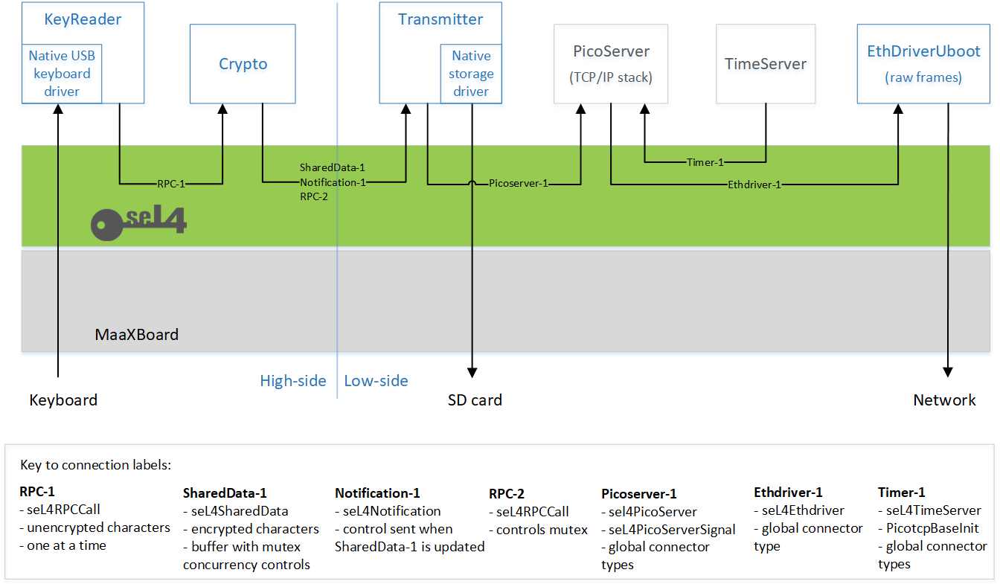

# Case Study Introduction

This section works through an example to show some of our device drivers being used within a larger CAmkES application. It is nominally labelled as a 'security domain' demonstrator (named `security_demo`) but this is mainly in the context of being a keyboard-based encryption device that was inspired by an Enigma machine! It is intentionally simple and its main purpose is to show data separation and to provide worked examples of inter-component communications using different seL4 mechanisms.

Extra functionality within the demonstration application is deliberately kept to a minimum to leave the source code less cluttered, so that the developer can readily see the 'more interesting' seL4 inter-component and device interactions without too much extra, feature-supporting code. In line with the rest of the developer kit, the demonstration application is intended to be more of a springboard for a developer kit user than a polished product for an end user.

As with earlier sections of this developer kit documentation, we continue to defer to the seL4 Foundation's [documentation of CAmkES](https://docs.sel4.systems/projects/camkes/) as the primary source of understanding of CAmkES, but this section will cover aspects of the use of CAmkES where appropriate.

## Basic Description

An operator types a plaintext message using a USB-connected keyboard. The application encrypts the message and transmits the resulting ciphertext via Ethernet to a client that has connected to a predetermined port. The application also records the ciphertext messages in a logfile on the SD card of the device.

## Architecture Overview

The architecture of the demonstrator is shown below.

Blue blocks show CAmkES components created specifically for the security demonstrator (or previously created within the developer kit in the case of [EthDriverUboot](uboot_driver_usage.md#test-application-picoserver_uboot)); grey blocks show CAmkES [global components](https://github.com/seL4/global-components).

Arrow directions show an abstracted view of data flow. Arrow labels refer to seL4 connector types (some concerned with data flow, some with control flow), which are elaborated in the key. More details about seL4 connector types may be found in the [CAmkES manual](https://docs.sel4.systems/projects/camkes/manual.html), but the fundamental types are _RPC_ (Remote Procedure Call), _SharedData_, and _Notification_ (see examples such as `seL4RPCCall` in the key).

As the KeyReader and Crypto components handle plaintext and cryptographic data (e.g. keys), they are considered as 'high-side' in terms of security and must be kept separate from the downstream 'low-side' components that handle ciphertext. It is not the role of this developer kit to re-justify the credentials of seL4 (the [seL4 whitepaper](https://sel4.systems/About/seL4-whitepaper.pdf) is a good starting point), but suffice to say that seL4's capability-based access controls guarantee protection and separation between all components, regardless of the notional high and low sides that we have overlaid, only allowing interactions between components where explicitly established via the seL4 connector types.

The following paragraphs briefly describe the data flow, from left to right, highlighting the different seL4 mechanisms used for inter-component communications.

### Components and Connector Types

Plaintext characters are typed on a keyboard and read by the KeyReader component. These characters are then 'encrypted' by the Crypto component to transform them into ciphertext. _RPC_ is an appropriate connector type for the character-by-character data flow between KeyReader and Crypto (labelled as RPC-1 on the diagram), employing `seL4RPCCall`. Since this application is more concerned with demonstrating seL4 concepts than crypto-algorithms, the Enigma machine's rotors and plugboard are replaced with a simple [ROT13](https://en.wikipedia.org/wiki/ROT13) algorithm!

The encrypted characters are transferred to the Transmitter component via a shared circular buffer, where Crypto writes to the _head_ of the buffer and Transmitter reads from its _tail_. The buffer is implemented as a _SharedData_ connection (labelled as SharedData-1 on the diagram) using `seL4SharedData`. (Note that within CAmkES, shared memory is abstracted as a _Dataport_, so this terminology is often seen associated with this connection type.)

If the buffer is full, Crypto discards characters; otherwise, each time Crypto writes a character to the buffer, it sends a _Notification_ to Transmitter (labelled as Notification-1 on the diagram) to signify that there is data to read, using `seL4Notification`. Transmitter acts upon notifications by reading all available characters until the buffer is empty.

The shared buffer is protected from concurrent access by use of a [mutex](https://en.wikipedia.org/wiki/Lock_(computer_science)). The mutex is owned by Crypto, and Transmitter accesses its lock and unlock operations via an _RPC_ connection (labelled as RPC-2); note that this is a control flow and is in the opposite direction to the arrow, which shows the data flow of encrypted characters.

The Transmitter component interfaces to PicoServer via three connections, as shown in the `picoserver_uboot` [test application diagram](uboot_driver_usage.md#test-application-picoserver_uboot): `send`, `receive`, and `control`. The `send` and `receive` connections are defined as global connector type `seL4PicoServer`, which is fundamentally `seL4RPCDataport` (_SharedData_ combined with _RPC_). The `control` connection has a global connector type of `seL4PicoServerSignal`, which is fundamentally `seL4RPCCallSignal` (_RPC_ combined with _Notification_). Note that although the interface between Transmitter and PicoServer configures `receive` in order to satisfy the CAmkES connections, the application does not process any Ethernet traffic in this direction, and only `send` is used.

The interface between PicoServer and EthDriverUboot uses the `seL4Ethdriver` global connector type, which is fundamentally another instance of `seL4RPCDataport` (_SharedData_ combined with _RPC_).

TimeServer, which supports timing functionality for PicoServer, uses the `seL4TimeServer` global connector type, which is fundamentally another instance of `seL4RPCCallSignal` (_RPC_ combined with _Notification_).

### Device Drivers

As can be seen from the architecture diagram, three hardware devices are involved in the operation of the application.

1. The KeyReader component requires access to the USB device to allow for plaintext characters to be input from a USB keyboard.

2. The Transmitter component requires access to the SD/MMC device to allow for the ciphertext message to be output to a log file.

3. The EthDriverUboot component requires access to the Ethernet device to allow for ciphertext message to be output to the network.

Device drivers for the required hardware access are supplied by the [U-Boot Driver Library](uboot_driver_library.md) previously introduced by this development kit.

Three separate instances of the library are used by the application, one per component with a need for hardware device access. The capabilities of each component, and their associated library instances, are configured such that each component is only capable of accessing the minimum set of hardware devices required to perform the desired function.

For example, the Transmitter component only has a need to access the SD/MMC device to write the ciphertext log file. As such, the capabilities of the Transmitter component permit it to access the memory-mapped interface of the SD/MMC device; however no such capabilities are provided for the USB or Ethernet devices. Any attempt by the Transmitter component to access the memory-mapped interface of the USB device (e.g. in an attempt to read the plaintext keypresses) would therefore be prevented by seL4.
