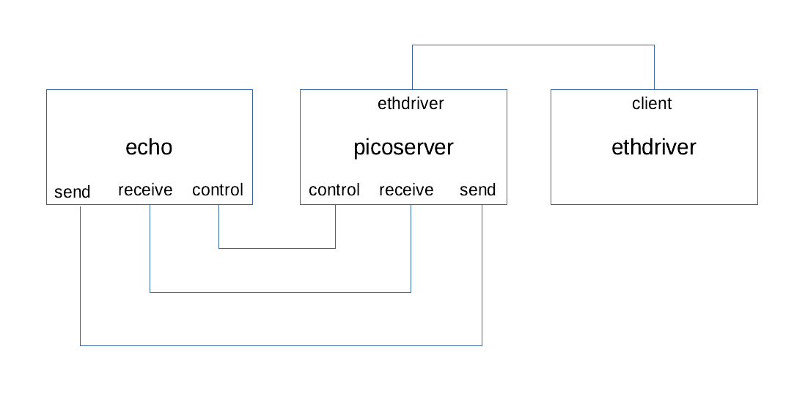

# Using the U-Boot Driver Library

This section outlines the library's API and provides instructions for running two test applications that demonstrate use of its drivers.

- [Library API](#library-api)
- [Test application: `uboot-driver-example`](#test-application-uboot-driver-example)
- [Test application: `picoserver_uboot`](#test-application-picoserver_uboot)

## Library API

At the core of the library's public API (see library folder `include/public_api` for full details) are:

- Routines to initialise (`initialise_uboot_drivers`) and shutdown (`shutdown_uboot_drivers`) the library that must book-end the usage of all other API routines;

- A routine (`run_uboot_command`) to allow execution of the same textual commands as used at the [U-Boot prompt](first_boot.md#boot-to-u-boot-prompt). For example, in the [I<sup>2</sup>C worked example](uboot_library_add_driver.md#establishing-the-driver-api), it is shown how the U-Boot `i2c` command is added and used, e.g. to probe the bus.

Although this provides a relatively simple API, it is intuitive as it has a direct analogue to the commands available at the U-Boot command line. There are limitations, but the API can be readily developed further to expose more functionality, for example:

- To accept arguments through parameter passing rather than through a textual command;

- To return data or results rather than printing outcomes to the console;

- To expose lower-level interfaces than the U-Boot commands permit, for example access to raw Ethernet frames.

It is expected that the source code of the U-Boot commands are likely to provide a starting point for extended API routines.

A number of worked examples have been provided for extensions to the core API described above:

- For accessing the `stdin` file maintained by U-Boot, routines `uboot_stdin_<...>` have been provided to enable testing whether characters are available and to retrieve them. The `uboot-driver-example` test application demonstrates usage of these API routines for retrieving characters typed on a connected USB keyboard.

- For reading and sending raw Ethernet frames, routines `uboot_eth_<...>` have been provided. The `picoserver_uboot` test application demonstrates usage of these API routines to integrate the library with the picoTCP stack.

Sections below give a basic overview of the test applications and how to build and run them.

## Test application: `uboot-driver-example`

### Overview of the `uboot-driver-example` test application

The source file at `camkes/apps/uboot-driver-example/components/Test/src/test.c` represents the script for the test application. It contains `run_uboot_cmd("...")` calls to U-Boot commands that are supported by the library. The set of supported commands can be readily seen in the `cmd_tbl` entries of `projects_libs/libubootdrivers/include/plat/maaxboard/plat_driver_data.h`.

It is left to the reader to look through the test script in detail, but the features demonstrated include the following.

- The MaaXBoard's two integral LEDs are toggled.
- Ping operations.
- USB operations[^1], including:
  - identify and list (`ls`) the contents of a USB flash drive, if connected;
  - read and echo keypresses from a USB keyboard, if connected, during a defined period.
- SD/MMC operations to identify and list (`ls`) the contents of the SD card.
- Filesystem operations to write a file to a FAT partition on the SD card before reading the contents back and deleting the file.
- I<sup>2</sup>C operations to probe the bus and read the power management IC present on the MaaXBoard's I<sup>2</sup>C bus. (There are more details in the [worked example](appendices/add_driver_worked_example.md) that walks through the steps that were required to add this driver.)
- SPI operations to access the SPI bus and read a BMP280 pressure sensor, if connected.
  - Procuring and connecting this sensor is an optional extra, described in the [SPI Bus Pressure Sensor appendix](appendices/spi_bmp280.md); otherwise these operations still run but return nothing in the test application.

[^1]: Note: Currently, only the upper USB port on the Avnet MaaXBoard is active (i.e. the port furthest away from the PCB); the lower USB port does not function. This is a feature of the power domains on the board, not the USB driver.

Other utility commands are exercised, such as `dm tree`, which is useful to follow the instantiation of device drivers, and `clocks` which lists all the available clocks. As well as 'headline' drivers like USB and SPI above, there are also some fundamental 'building block' drivers in the library, for elements such as clocks, IOMUX, and GPIO, which are needed by other drivers.

#### Configuration for different platforms

Although `uboot-driver-example` was created to demonstrate the device drivers developed for this MaaXBoard developer kit, it is configurable to support other platforms. For example, in the [worked example appendix for the Odroid-C2](appendices/add_odroidc2.md), a small subset of drivers has been developed for that platform, and the `test.c` source file for `uboot-driver-example` uses the preprocessor macros `CONFIG_PLAT_MAAXBOARD` and `CONFIG_PLAT_ODROIDC2` to configure which commands are run for each platform. By default, all tests are enabled for an unrecognised platform, but this would be readily configured for a new platform's `CONFIG_PLAT_...` preprocessor macro.

### Instructions for running `uboot-driver-example`

As usual, this assumes that the user is already running a Docker container within the [build environment](build_environment_setup.md), where we can create a directory and clone the code and dependencies.

```text
mkdir /host/uboot_test
cd /host/uboot_test
```

```bash
repo init -u https://github.com/sel4devkit/camkes-manifest.git
```

```bash
repo sync
```

The test application includes an Ethernet operation (`ping`) with hard-coded IP addresses; these need to be customised for an individual's environment. The following lines of the source file `projects/camkes/apps/uboot-driver-example/components/Test/src/test.c` should be edited:

```c
run_uboot_command("setenv ipaddr xxx.xxx.xxx.xxx"); // IP address to allocate to MaaXBoard
run_uboot_command("ping yyy.yyy.yyy.yyy"); // IP address of host machine
```

Optionally, to `ping` to an address beyond the local network:

```c
run_uboot_command("setenv gatewayip zzz.zzz.zzz.zzz"); // IP address of router
run_uboot_command("setenv netmask 255.255.255.0");
run_uboot_command("ping 8.8.8.8"); // An example internet IP address (Google DNS)
```

From the `/host/uboot_test` directory, execute the following commands:

```text
mkdir build
cd build
```

```bash
../init-build.sh -DCAMKES_APP=uboot-driver-example -DPLATFORM=maaxboard -DSIMULATION=FALSE
```

```bash
ninja
```

A successful build will result in an executable file called `capdl-loader-image-arm-maaxboard` in the `images` subdirectory. This should be copied to a file named `sel4_image` and then made available to the preferred loading mechanism, such as TFTP, as per [Execution on Target Platform](execution_on_target_platform.md).

## Test application: `picoserver_uboot`

### Overview of the `picoserver_uboot` test application

It is not the purpose of this developer kit to give a CAmkES tutorial (e.g. see [seL4's documentation](https://docs.sel4.systems/projects/camkes/)), but this application is based on the following CAmkES model:



EthDriverUboot is a simple implementation of an Ethernet driver that has been ported from U-Boot. PicoServer provides a picoTCP TCP/IP stack on top of this, and the Echo component simply listens on port 1234 of a given IP address, echoing received characters on the display. (An additional component TimeServer has been omitted from the diagram for clarity, but see the [case study application](case_study_intro.md) for more details.)

### Instructions for running `picoserver_uboot`

As usual, this assumes that the user is already running a Docker container within the [build environment](build_environment_setup.md), where we can create a directory and clone the code and dependencies.

```text
mkdir /host/uboot_pico
cd /host/uboot_pico
```

```bash
repo init -u https://github.com/sel4devkit/camkes-manifest.git
```

```bash
repo sync
```

From the `/host/uboot_pico` directory, execute the following commands:

```text
mkdir build
cd build
```

```bash
../init-build.sh -DCAMKES_APP=picoserver_uboot -DPLATFORM=maaxboard -DSIMULATION=FALSE -DPICOSERVER_IP_ADDR=xxx.xxx.xxx.xxx
ninja
```

where `xxx.xxx.xxx.xxx` is the IP address to allocate to the MaaXBoard.

A successful build will result in an executable file called `capdl-loader-image-arm-maaxboard` in the `images` subdirectory. This should be copied to a file named `sel4_image` and then made available to the preferred loading mechanism, such as TFTP, as per [Execution on Target Platform](execution_on_target_platform.md).

When the `picoserver_uboot` application is running on the MaaXBoard, it should confirm that it is listening on port 1234 of the supplied IP address. It will also confirm registration of the protocol stack layers. The application allocates a random MAC address.

At any time while running, the application may display `No such port ....` messages as it monitors traffic on the network; this is expected behaviour that may be ignored.

Meanwhile, from a terminal window on the host machine, use the `netcat` (`nc`) command (native to Linux or macOS, or available as a [download](https://nmap.org/ncat/) for Windows), where `xxx.xxx.xxx.xxx` is the IP address of the MaaXBoard, as previously specified:

```bash
nc xxx.xxx.xxx.xxx 1234
```

On the MaaXBoard (via CoolTerm as usual), a message like the following should be seen:

```text
echo: Connection established with yyy.yyy.yyy.yyy on socket 1
```

where `yyy.yyy.yyy.yyy` is the IP address of the host machine.

From the host machine's terminal, strings may be typed until `nc` is terminated with Ctrl-C:

```bash
hostmachine ~ % nc 192.168.0.111 1234
Hello world!
Goodbye
^C
hostmachine ~ %
```

Each time carriage return is entered, the `picoserver_uboot` application will display the string, until the `nc` session is terminated, upon which the connection will be closed:

```text
echo: Connection established with 192.168.0.11 on socket 1
echo: Received message of length 13 --> Hello world!
echo: Received message of length 8 --> Goodbye
echo: Connection closing on socket 2
echo: Connection closed on socket 2
```

Connections can be re-established simply by issuing another `nc` command.

#### Implementation note

Connecting, disconnecting, and reconnecting to a network can give rise to delays in the order of a few minutes while the elements in the network handshake and resynchronise, particularly in the case of our application, which assigns a random MAC address to the same IP address each time it runs. If the connection is not established promptly, the easiest remedial options are:

- Start from a clean reboot of the host machine (which will include flushing its DNS cache); or
- Be patient! (If you are prepared to wait for a few minutes, the connection will be made. Note that `nc` may timeout after a while if no connection is made, so the command would need to be repeated.)

## Appendices

- [SPI Bus Pressure Sensor](./appendices/spi_bmp280.md)
- [Odroid-C2 Worked Example](./appendices/add_odroidc2.md)
